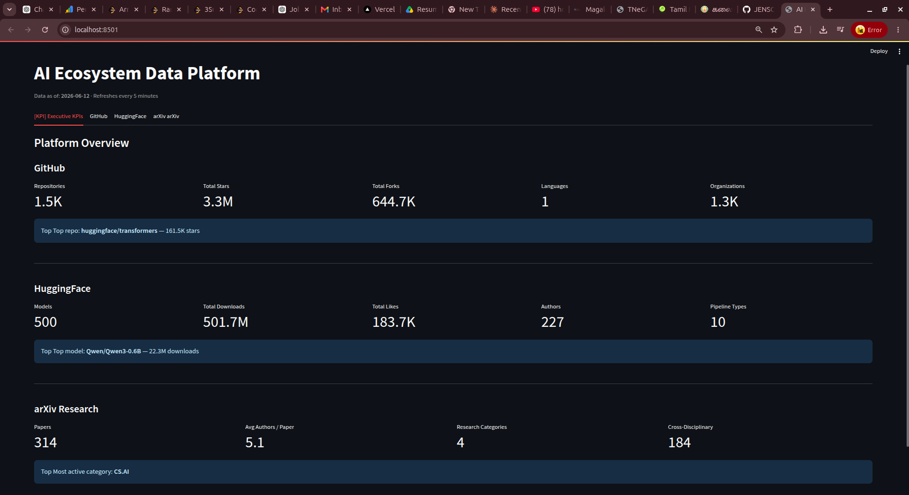
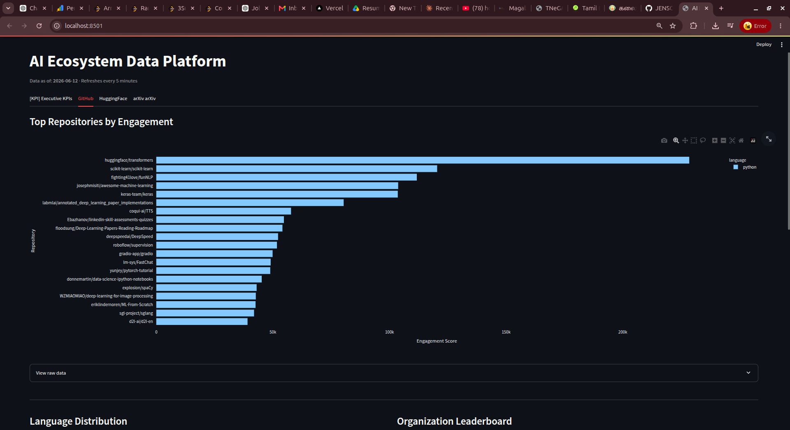
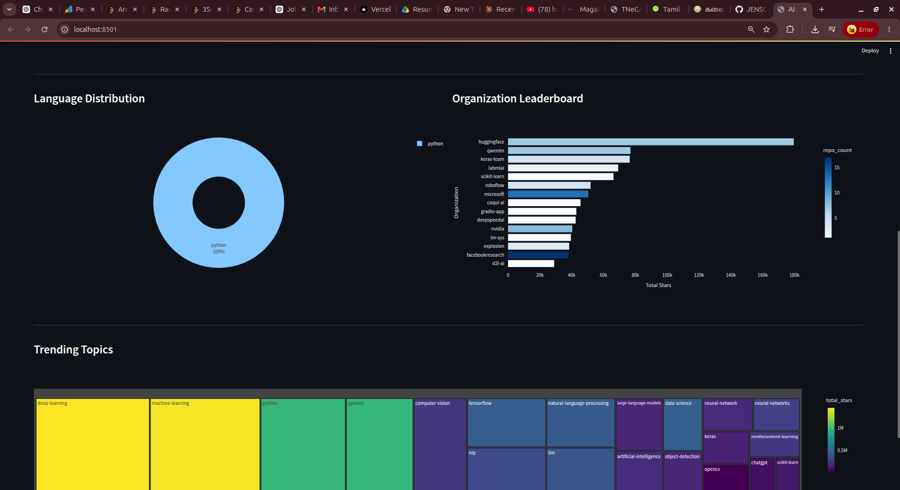
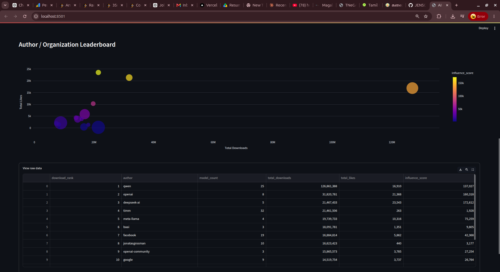
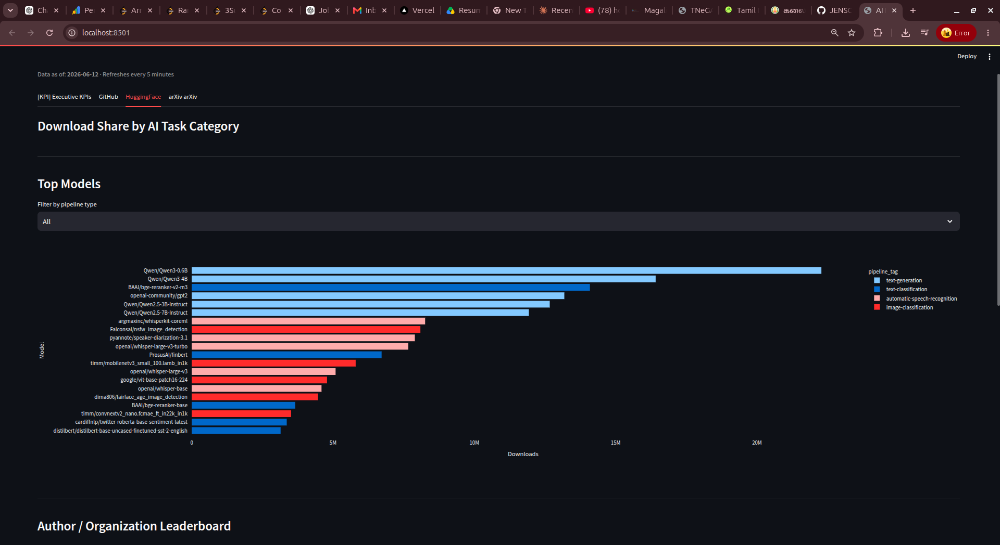
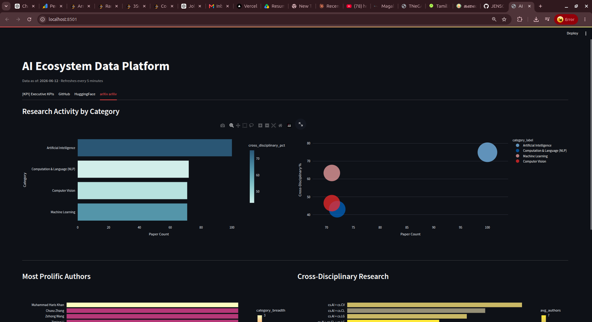

# AI Ecosystem Data Platform

An end-to-end Data Engineering portfolio project that collects, processes, and visualizes data from GitHub, HuggingFace, and arXiv — powered by Apache Spark, Airflow, PostgreSQL, and Streamlit.

## Architecture

```
Public APIs (GitHub · HuggingFace · arXiv)
        ↓
   Raw Layer  (JSON — data_lake/raw/)
        ↓
  Apache Spark ETL
        ↓
  Silver Layer  (cleaned Parquet — data_lake/silver/)
        ↓
   Gold Layer  (business metrics Parquet — data_lake/gold/)
        ↓
   PostgreSQL  (star schema serving layer)
        ↓
    Streamlit  (interactive dashboard)
```

## Dashboard Screenshots

### Executive KPI Dashboard


### GitHub



### HuggingFace



### arXiv Research


---

## Tech Stack

| Layer | Technology |
|---|---|
| Ingestion | Python, requests, httpx |
| Processing | Apache Spark 3, PySpark |
| Storage | Local Data Lake (Parquet), PostgreSQL 15 |
| Orchestration | Apache Airflow 2 |
| Dashboard | Streamlit |
| Infrastructure | Docker, Docker Compose |
| Language | Python 3.12 |

## Quick Start

```bash
# 1. Clone and navigate
cd ai-ecosystem-data-platform

# 2. Set your GitHub token
echo "GITHUB_TOKEN=your_token_here" >> .env

# 3. Build and start all services
docker-compose up --build -d

# 4. Wait ~60 seconds, then access:
```

| Service | URL | Credentials |
|---|---|---|
| Spark Master UI | http://localhost:8080 | — |
| Airflow UI | http://localhost:8081 | admin / admin |
| Streamlit Dashboard | http://localhost:8501 | — |
| PostgreSQL | localhost:5432 | platform / platform123 |

## Project Structure

```
ai-ecosystem-data-platform/
├── ingestion/              # Phase 2 — API clients (GitHub, HuggingFace, arXiv)
├── spark_jobs/
│   ├── silver/             # Phase 4 — cleaning & standardization
│   └── gold/               # Phase 5 — business metric aggregations
├── postgres/
│   ├── schema.sql          # Star schema (dim + fact tables)
│   ├── setup_db.py         # One-time DB/user/table creation
│   ├── loader.py           # Phase 6 — Gold → PostgreSQL loader
│   └── queries.py          # Reusable query functions for the dashboard
├── airflow/dags/           # Phase 7 — orchestration DAGs
├── dashboards/             # Phase 8 — Streamlit app
├── data_lake/
│   ├── raw/                # Landing zone (JSON)
│   ├── silver/             # Cleaned data (Parquet)
│   └── gold/               # Business metrics (Parquet)
├── docker/                 # Dockerfiles + postgres-init.sql
├── docker-compose.yml
├── requirements.txt          # App deps (Spark, dashboard, ingestion)
└── requirements-airflow.txt  # Airflow-compatible deps (pydantic v1, sqlalchemy v1)
```

## Data Sources

| Source | Data Collected | Purpose |
|---|---|---|
| GitHub API | repos, stars, forks, topics, language | Trending repos, org rankings, topic analysis |
| HuggingFace API | models, downloads, likes, pipeline tags | Model rankings, author influence, task categories |
| arXiv API | papers, authors, categories, dates | Research trends, prolific authors, cross-disciplinary work |

## Data Lake Design

### Raw Layer
JSON files written by ingestion clients, partitioned by source and date.

### Silver Layer
Cleaned, deduplicated, typed Parquet files. PySpark handles null handling, column normalization, and schema enforcement.

### Gold Layer
Aggregated business metric tables ready for serving:

| Gold Table | Description |
|---|---|
| `github_trends/top_repos` | Top repos ranked by engagement score |
| `github_trends/topic_trends` | Topic popularity by repo count and stars |
| `github_trends/org_leaderboard` | Organizations ranked by total stars |
| `ai_models/top_models` | Top HuggingFace models per pipeline type |
| `ai_models/author_leaderboard` | Author influence by downloads |
| `ai_models/pipeline_summary` | Download share by AI task category |
| `research_trends/category_trends` | arXiv paper counts per category |
| `research_trends/prolific_authors` | Most published arXiv authors |
| `research_trends/cross_disciplinary` | Multi-category research combinations |
| `executive_metrics/kpis` | Daily headline KPIs across all sources |

## PostgreSQL Schema

Star schema in the `ai_platform` schema.

**Dimension tables:** `dim_repositories`, `dim_models`

**Fact tables:** `fact_github_trends`, `fact_topic_trends`, `fact_org_leaderboard`, `fact_model_metrics`, `fact_author_leaderboard`, `fact_pipeline_summary`, `fact_research_trends`, `fact_author_metrics`, `fact_cross_disciplinary`, `fact_executive_kpis`

### Setup (run once before first pipeline execution)

```bash
python postgres/setup_db.py
```

### Load Gold → PostgreSQL

```bash
python postgres/loader.py
```

The loader uses a truncate-then-insert strategy — Gold tables are fully recomputed daily, so a clean reload guarantees consistency with no stale rows.

## How the Pipeline Works End to End

### Full Pipeline Flow

```
You (or Airflow scheduler at 06:00 UTC)
        │
        ▼
 ingestion/run_ingestion.py
        ├── GitHubIngester      → data_lake/raw/github/github_2026-06-13.json
        ├── HuggingFaceIngester → data_lake/raw/huggingface/huggingface_2026-06-13.json
        └── ArxivIngester       → data_lake/raw/arxiv/arxiv_2026-06-13.json
                │
                ▼
        ingestion/validate.py   (quality gate — fails fast if data is bad)
                │
                ▼
        spark_jobs/run_silver.py
                ├── data_lake/silver/github/batch_date=2026-06-13/
                ├── data_lake/silver/huggingface/batch_date=2026-06-13/
                └── data_lake/silver/arxiv/batch_date=2026-06-13/
                        │
                        ▼
                spark_jobs/run_gold.py
                        ├── data_lake/gold/github_trends/top_repos/
                        ├── data_lake/gold/ai_models/top_models/
                        ├── data_lake/gold/research_trends/
                        └── data_lake/gold/executive_metrics/kpis/
                                │
                                ▼
                        postgres/loader.py
                                ├── TRUNCATE + reload fact_github_trends
                                ├── TRUNCATE + reload fact_model_metrics
                                ├── TRUNCATE + reload fact_research_trends
                                └── TRUNCATE + reload fact_executive_kpis
                                        │
                                        ▼
                                PostgreSQL ai_platform database
                                        │
                                        ▼
                                Streamlit Dashboard
```

### How Each Layer Handles New Data

| Layer | Behavior | Why |
|---|---|---|
| Raw JSON | New file per day — old files kept forever | Full audit trail, re-run without hitting APIs |
| Silver Parquet | New partition per day — old partitions kept | Enables historical trend analysis |
| Gold Parquet | Fully overwritten on every run | Always reflects latest metrics |
| PostgreSQL | Truncated + reloaded every run | Dashboard always shows fresh, consistent data |

### How Each Layer Knows What to Read

**Ingester** saves to a dated filename:
```
data_lake/raw/github/github_2026-06-13.json
```

**Spark Silver** reads all files in the folder with a wildcard:
```python
spark.read.json("data_lake/raw/github/*.json")
# Automatically picks up every daily file
```

**Spark Gold** reads all Silver partitions at once:
```python
spark.read.parquet("data_lake/silver/github")
# Spark reads all batch_date= folders automatically
```

**Loader** reads Gold Parquet and writes to PostgreSQL:
```python
df = pq.read_table(gold_path).to_pandas()
# TRUNCATE table, then COPY all rows in one fast operation
```

### Loose Coupling — Why This Architecture Scales

Each layer only knows about the layer directly above it:
- The loader does not know how Gold was computed — it just reads Parquet files
- Gold does not know how Silver was cleaned — it just reads Parquet files
- Silver does not know what API the data came from — it just reads JSON files

This means you can swap out the GitHub API client, fix a Silver bug, or change a Gold metric — and only that one layer needs to change.

---

## Scheduling and Backfilling

### Daily Scheduling (Automatic)

The Airflow DAG `ai_platform_daily_pipeline` runs every day at 06:00 UTC:

```
Airflow scheduler wakes up at 06:00 UTC
        │
        ▼
Creates a DAG Run for today's date
        │
        ▼
Runs: ingest → validate → silver → gold → load postgres
        │
        ▼
New data available in dashboard
```

The schedule is defined as a cron expression in the DAG:
```python
schedule="0 6 * * *"   # every day at 06:00 UTC
```

`max_active_runs=1` prevents two daily runs from overlapping if one runs slow.

### Backfilling — Reprocessing Past Data

**Scenario 1 — You fixed a bug in Silver or Gold logic:**

You do NOT need to re-fetch from the APIs. The raw JSON files already exist.
Trigger the reprocess DAG which skips ingestion entirely:

```bash
# From Airflow UI: trigger ai_platform_reprocess manually
# Or from terminal:
airflow dags trigger ai_platform_reprocess
```

This runs: Silver → Gold → PostgreSQL using existing raw files.

**Scenario 2 — Pipeline missed a day (server was down):**

```bash
# Backfill specific date range
airflow dags backfill \
  --start-date 2026-06-10 \
  --end-date 2026-06-12 \
  ai_platform_daily_pipeline
```

This re-runs the full pipeline for each missed date in order.

`catchup=False` in our DAG means Airflow will NOT automatically backfill missed runs when you first deploy — you control backfills manually.

### The Three DAGs

| DAG | Schedule | Purpose |
|---|---|---|
| `ai_platform_daily_pipeline` | Daily 06:00 UTC | Full pipeline — ingest → silver → gold → postgres |
| `ai_platform_reprocess` | Manual only | Reprocess Silver → Gold → PostgreSQL from existing raw files |
| `ai_platform_health_check` | Every hour | Check PostgreSQL connectivity, data freshness, row counts |

### Retry Logic

Every task is configured with:
```python
retries=2                        # retry up to 2 times
retry_delay=timedelta(minutes=5) # wait 5 minutes between retries
retry_exponential_backoff=True   # 5min → 10min on successive retries
execution_timeout=timedelta(hours=1)  # kill task if it hangs > 1 hour
```

If all retries are exhausted, Airflow marks the task as failed and stops the downstream pipeline — bad data never reaches PostgreSQL.

---

## Running the Pipeline Manually

```bash
# 1. Ingest raw data from all APIs
python ingestion/run_ingestion.py

# 2. Run Silver layer (clean + standardize)
python spark_jobs/run_silver.py

# 3. Run Gold layer (compute business metrics)
python spark_jobs/run_gold.py

# 4. Load Gold into PostgreSQL
python postgres/loader.py

# 5. Launch dashboard
streamlit run dashboards/app.py
```

## Development Phases

| Phase | Description | Status |
|---|---|---|
| 1 | Environment Setup | ✅ |
| 2 | Data Ingestion (GitHub, HuggingFace, arXiv) | ✅ |
| 3 | Spark Fundamentals & Exploration | ✅ |
| 4 | Silver Layer (PySpark cleaning) | ✅ |
| 5 | Gold Layer (PySpark aggregations) | ✅ |
| 6 | PostgreSQL Loading (star schema + loader) | ✅ |
| 7 | Airflow Orchestration | ✅ |
| 8 | Streamlit Dashboard | ✅ |
| 9 | Testing | ✅ |
| 10 | Production Readiness | ✅ |

## Running Tests

```bash
# Non-Spark tests (fast, no JVM required)
python3 -m pytest tests/test_ingestion_base.py tests/test_validation.py tests/test_loader.py -v

# All tests including Spark
python3 -m pytest tests/ -v

# Skip Spark tests
python3 -m pytest tests/ -m "not spark" -v
```

## Secrets

- `.env` is in `.gitignore` — never committed
- Copy `.env.example` → `.env` and fill in your tokens
- Rotate your GitHub token at https://github.com/settings/tokens if it may have been exposed

## Docs

- [Runbook](docs/runbook.md) — setup, operations, failure recovery, common fixes

## Teardown

```bash
docker-compose down        # Stop containers, keep volumes
docker-compose down -v     # Stop and delete all data
```
